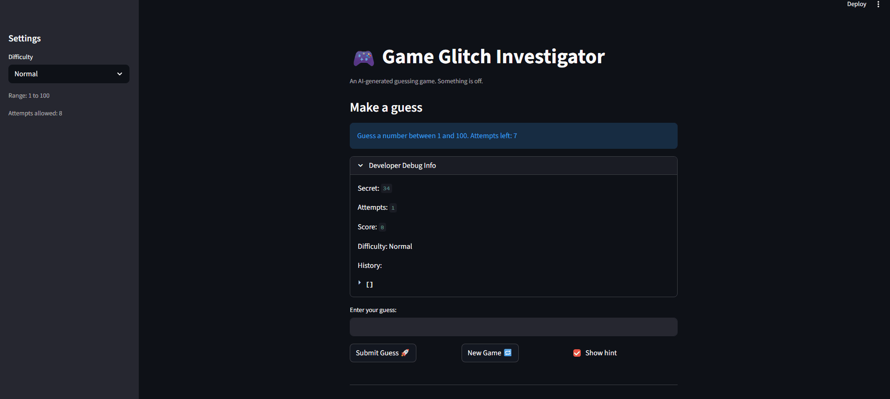

# 🎮 Game Glitch Investigator: The Impossible Guesser

## 🚨 The Situation

You asked an AI to build a simple "Number Guessing Game" using Streamlit.
It wrote the code, ran away, and now the game is unplayable. 

- You can't win.
- The hints lie to you.
- The secret number seems to have commitment issues.

## 🛠️ Setup

1. Install dependencies: `pip install -r requirements.txt`
2. Run the broken app: `python -m streamlit run app.py`

## 🕵️‍♂️ Your Mission

1. **Play the game.** Open the "Developer Debug Info" tab in the app to see the secret number. Try to win.
2. **Find the State Bug.** Why does the secret number change every time you click "Submit"? Ask ChatGPT: *"How do I keep a variable from resetting in Streamlit when I click a button?"*
3. **Fix the Logic.** The hints ("Higher/Lower") are wrong. Fix them.
4. **Refactor & Test.** - Move the logic into `logic_utils.py`.
   - Run `pytest` in your terminal.
   - Keep fixing until all tests pass!

## 📝 Document Your Experience

- [x] **Game purpose:** A number guessing game where the player tries to guess a secret number within a limited number of attempts. The game gives hints after each guess ("Too High" or "Too Low") and tracks a score based on how quickly you win.
- [x] **Bugs found:**
  - Hints were backwards — the `check_guess` function swapped the "Go HIGHER" and "Go LOWER" messages.
  - On every even attempt, `app.py` converted the secret number to a string before comparing it, causing string-based comparison instead of numeric comparison and breaking hints every other guess.
  - After winning and starting a new game, the game state wasn't resetting properly, preventing new guesses from being submitted.
  - The input field allowed guesses outside the valid range (below 1 or above 100) without blocking them.
- [x] **Fixes applied:**
  - Refactored all four core functions (`get_range_for_difficulty`, `parse_guess`, `check_guess`, `update_score`) out of `app.py` and into `logic_utils.py`.
  - Removed the string conversion bug in `app.py` — the integer secret is now always passed directly to `check_guess`.
  - Updated `check_guess` in `logic_utils.py` to return a plain outcome string (`"Win"`, `"Too High"`, `"Too Low"`) instead of a tuple, matching what the tests expect.
  - Added out-of-range validation in the submit handler to reject guesses outside `[low, high]`.

## 📸 Demo

- [x] 

## 🚀 Stretch Features

- [ ] [If you choose to complete Challenge 4, insert a screenshot of your Enhanced Game UI here]
